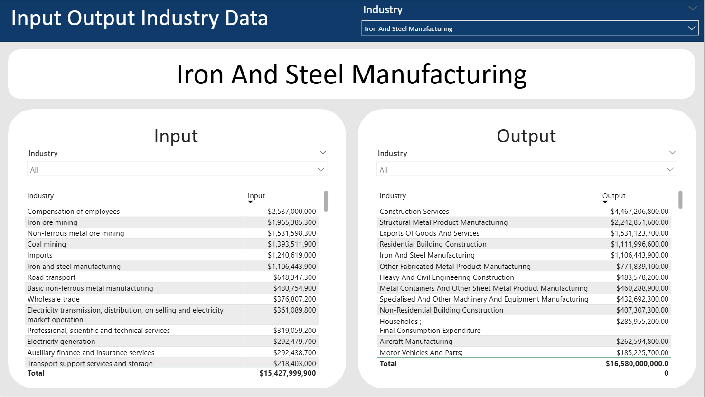
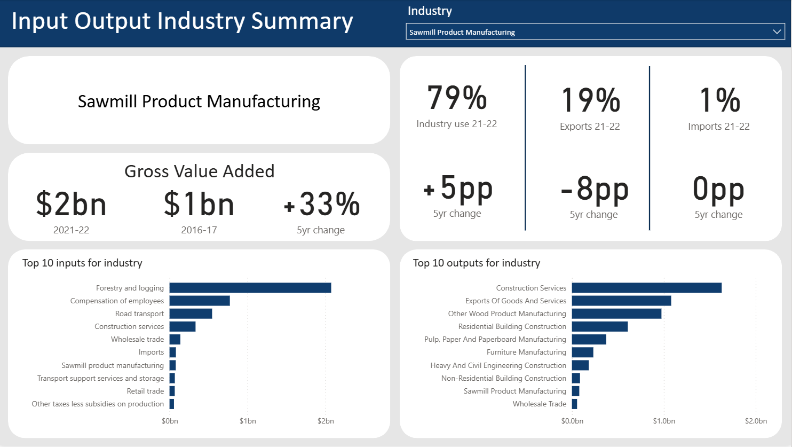

# 🏗️ Australian Input–Output Dashboard (Power BI)

A Power BI report that lets you explore **industry-level input–output relationships** for the Australian economy.  
The dashboard covers **financial year 2021-22** alongside **2016-17** to highlight **five-year changes** in value flows, industry mix and gross value added (GVA).

   
  <em>Industry-level input and output table (example: Iron & Steel Manufacturing)</em>

   
  <em>At-a-glance summary with GVA growth, trade shares, and top 10 flows (example: Sawmill Product Manufacturing)</em>

---

## ✨ Key features
| Feature | What it does |
|---------|--------------|
| **Dynamic industry selector** | Pick any ANZSIC industry to refresh every visual in real time. |
| **Side-by-side input / output tables** | See the top contributing industries (inputs) and destinations (outputs) ranked by dollar value. |
| **Five-year deltas** | Built-in comparison between 2021-22 and 2016-17 for trade shares (domestic use, exports, imports) and GVA. |
| **Top-10 bar charts** | Quick visual of the largest flows driving each industry’s supply chain. |

---

## 📊 Data sources

| Dataset | Publisher | Notes |
|---------|-----------|-------|
| **Input–Output Tables, 2021-22** | Australian Bureau of Statistics (ABS) | Latest symmetric I-O matrix (current prices). |
| **Input–Output Tables, 2016-17** | Australian Bureau of Statistics (archived release) | Used to calculate five-year change metrics. |

All dollar values are nominal (unadjusted for inflation).  

---
